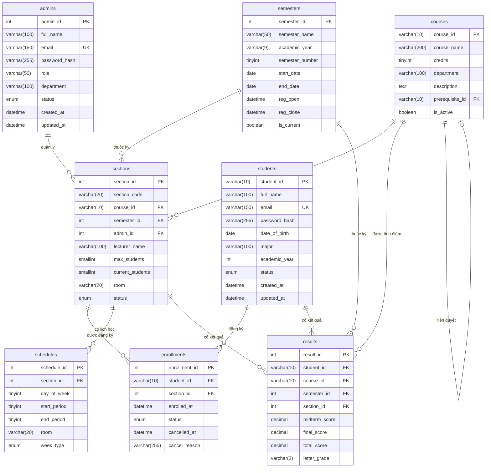

# Tài liệu Cơ sở dữ liệu - Hệ thống Quản lý và Đăng ký Học phần

Hệ quản trị cơ sở dữ liệu: MySQL 8.0+ / MariaDB 10.6+  
Bộ mã ký tự: utf8mb4 | Đối sánh: utf8mb4_unicode_ci

---

## Mục lục

1. [Tổng quan](#1-tổng-quan)
2. [Sơ đồ ERD](#2-sơ-đồ-erd)
3. [Chi tiết các bảng dữ liệu](#3-chi-tiết-các-bảng-dữ liệu)
4. [Quan hệ và Khóa ngoại](#4-quan-hệ-và-khóa-ngoại)
5. [Chỉ mục (Indexes)](#5-chỉ-mục-indexes)
6. [Quy tắc nghiệp vụ và Ràng buộc](#6-quy-tắc-nghiệp-vụ-và-ràng-buộc)
7. [Hướng dẫn triển khai di cư (Migration)](#7-hướng-dẫn-triển-khai-di-cư-migration)
8. [Dữ liệu mẫu khởi tạo](#8-dữ-liệu-mẫu-khởi-tạo)

---

## 1. Tổng quan

Hệ thống được thiết kế với 8 bảng chính trong cơ sở dữ liệu quan hệ:

| STT | Tên bảng | Mô tả | Số lượng cột |
|-----|----------|-------|---------------|
| 1 | students | Lưu trữ thông tin sinh viên và tài khoản người dùng | 10 |
| 2 | admins | Lưu trữ thông tin quản trị viên hệ thống | 9 |
| 3 | courses | Danh mục các môn học trong chương trình đào tạo | 7 |
| 4 | semesters | Thông tin về các học kỳ và thời gian đăng ký | 9 |
| 5 | sections | Các lớp học phần cụ thể được mở theo kỳ | 10 |
| 6 | schedules | Thời khóa biểu chi tiết cho từng lớp học phần | 7 |
| 7 | enrollments | Thông tin đăng ký học phần của sinh viên | 7 |
| 8 | results | Kết quả học tập và điểm số của sinh viên | 8 |

---

## 2. Sơ đồ ERD



---

## 3. Chi tiết các bảng dữ liệu

### 3.1 Bảng students - Thông tin sinh viên

Bảng này lưu trữ thông tin cá nhân và dữ liệu đăng nhập của sinh viên.

| Tên cột | Kiểu dữ liệu | Loại khóa | Bắt buộc | Mặc định | Mô tả |
|---------|--------------|-----------|----------|----------|-------|
| student_id | VARCHAR(10) | Khóa chính | Có | - | Mã sinh viên |
| full_name | VARCHAR(100) | - | Có | - | Họ và tên đầy đủ |
| email | VARCHAR(150) | Duy nhất | Có | - | Địa chỉ email liên hệ |
| password_hash | VARCHAR(255) | - | Có | - | Mật khẩu đã được mã hóa theo Bcrypt |
| date_of_birth | DATE | - | Không | NULL | Ngày tháng năm sinh |
| major | VARCHAR(100) | - | Không | NULL | Chuyên ngành theo học |
| academic_year | INT | - | Không | NULL | Niên khóa nhập học |
| status | ENUM | - | Có | 'active' | Trạng thái: active, suspended, graduated |
| created_at | DATETIME | - | Có | CURRENT_TIMESTAMP | Thời điểm khởi tạo tài khoản |
| updated_at | DATETIME | - | Có | CURRENT_TIMESTAMP | Thời điểm cập nhật cuối cùng |

Ghi chú bảo mật: Mật khẩu được mã hóa sử dụng thuật toán Bcrypt với salt rounds là 10. Email được ràng buộc duy nhất trên toàn hệ thống.

---

### 3.4 Bảng admins - Quản trị viên hệ thống

Lưu trữ thông tin về các quản trị viên hệ thống có quyền quản lý các tài nguyên.

| Tên cột | Kiểu dữ liệu | Loại khóa | Bắt buộc | Mặc định | Mô tả |
|---------|--------------|-----------|----------|----------|-------|
| admin_id | INT | Khóa chính | Có | Tự tăng | Mã định danh quản trị viên |
| full_name | VARCHAR(100) | - | Có | - | Họ và tên đầy đủ |
| email | VARCHAR(150) | Duy nhất | Có | - | Địa chỉ email liên hệ |
| password_hash | VARCHAR(255) | - | Có | - | Mật khẩu đã được mã hóa theo Bcrypt |
| role | VARCHAR(50) | - | Có | 'admin' | Vai trò: admin, manager, staff |
| department | VARCHAR(100) | - | Không | NULL | Khoa/Phòng quản lý |
| status | ENUM | - | Có | 'active' | Trạng thái: active, inactive, suspended |
| created_at | DATETIME | - | Có | CURRENT_TIMESTAMP | Thời điểm khởi tạo tài khoản |
| updated_at | DATETIME | - | Có | CURRENT_TIMESTAMP | Thời điểm cập nhật cuối cùng |

Ghi chú bảo mật: Mật khẩu được mã hóa sử dụng thuật toán Bcrypt với salt rounds là 10. Email được ràng buộc duy nhất trên toàn hệ thống.

---

### 3.5 Bảng courses - Danh mục môn học

Thông tin về các môn học hiện có trong hệ thống giảng dạy.

| Tên cột | Kiểu dữ liệu | Loại khóa | Bắt buộc | Mặc định | Mô tả |
|---------|--------------|-----------|----------|----------|-------|
| course_id | VARCHAR(10) | Khóa chính | Có | - | Mã chính thức của môn học |
| course_name | VARCHAR(200) | - | Có | - | Tên gọi của môn học |
| credits | TINYINT | - | Có | - | Số đơn vị học trình (1-10) |
| department | VARCHAR(100) | - | Không | NULL | Khoa quản lý chuyên môn |
| description | TEXT | - | Không | NULL | Nội dung tóm tắt môn học |
| prerequisite_id | VARCHAR(10) | Khóa ngoại | Không | NULL | Mã môn học tiên quyết bắt buộc |
| is_active | BOOLEAN | - | Có | TRUE | Trạng thái hiển thị môn học |

Ghi chú: Cột prerequisite_id là khóa ngoại tự tham chiếu đến chính bảng courses.

---

### 3.6 Bảng semesters - Học kỳ

Quản lý thông tin thời gian theo từng giai đoạn học tập.

| Tên cột | Kiểu dữ liệu | Loại khóa | Bắt buộc | Mặc định | Mô tả |
|---------|--------------|-----------|----------|----------|-------|
| semester_id | INT | Khóa chính | Có | Tự tăng | Mã định danh học kỳ |
| semester_name | VARCHAR(50) | - | Có | - | Tên học kỳ (VD: HK1 2024-2025) |
| academic_year | VARCHAR(9) | - | Có | - | Niên khóa (VD: 2024-2025) |
| semester_number | TINYINT | - | Có | - | Thứ tự kỳ: 1, 2 hoặc 3 (Hè) |
| start_date | DATE | - | Có | - | Ngày bắt đầu học kỳ |
| end_date | DATE | - | Có | - | Ngày kết thúc học kỳ |
| reg_open | DATETIME | - | Có | - | Thời điểm bắt đầu cho phép đăng ký |
| reg_close | DATETIME | - | Có | - | Thời điểm đóng hệ thống đăng ký |
| is_current | BOOLEAN | - | Có | FALSE | Đánh dấu học kỳ hiện tại |

Quy tắc: Hệ thống chỉ cho phép duy nhất một học kỳ có trạng thái is_current là TRUE tại mọi thời điểm.

---

### 3.7 Bảng sections - Lớp học phần

Các lớp học phần cụ thể được triển khai dựa trên danh mục môn học trong từng kỳ.

| Tên cột | Kiểu dữ liệu | Loại khóa | Bắt buộc | Mặc định | Mô tả |
|---------|--------------|-----------|----------|----------|-------|
| section_id | INT | Khóa chính | Có | Tự tăng | Mã định danh lớp học phần |
| section_code | VARCHAR(20) | - | Có | - | Mã định danh lớp (VD: IT3001.01) |
| course_id | VARCHAR(10) | Khóa ngoại | Có | - | Tham chiếu đến bảng môn học |
| semester_id | INT | Khóa ngoại | Có | - | Tham chiếu đến bảng học kỳ |
| admin_id | INT | Khóa ngoại | Không | NULL | Quản trị viên quản lý lớp |
| lecturer_name | VARCHAR(100) | - | Không | NULL | Tên giảng viên phụ trách lớp |
| max_students | SMALLINT | - | Có | - | Giới hạn số lượng sinh viên tối đa |
| current_students | SMALLINT | - | Có | 0 | Số lượng sinh viên đã đăng ký thành công |
| room | VARCHAR(20) | - | Không | NULL | Địa điểm phòng học dự kiến |
| status | ENUM | - | Có | 'open' | Trạng thái: open, closed, cancelled |

---

### 3.8 Bảng schedules - Thời khóa biểu

Chi tiết về lịch học của từng buổi trong tuần cho mỗi lớp học phần.

| Tên cột | Kiểu dữ liệu | Loại khóa | Bắt buộc | Mặc định | Mô tả |
|---------|--------------|-----------|----------|----------|-------|
| schedule_id | INT | Khóa chính | Có | Tự tăng | Mã định danh bản ghi lịch học |
| section_id | INT | Khóa ngoại | Có | - | Thuộc lớp học phần cụ thể |
| day_of_week | TINYINT | - | Có | - | Thứ mấy trong tuần (2 đến 8) |
| start_period | TINYINT | - | Có | - | Tiết học bắt đầu (1-12) |
| end_period | TINYINT | - | Có | - | Tiết học kết thúc (1-12) |
| room | VARCHAR(20) | - | Không | NULL | Phòng học cụ thể cho buổi đó |
| week_type | ENUM | - | Có | 'all' | Tần suất: all, odd (lẻ), even (chẵn) |

---

### 3.9 Bảng enrollments - Đăng ký học phần

Ghi nhận các yêu cầu đăng ký học phần chính thức của sinh viên.

| Tên cột | Kiểu dữ liệu | Loại khóa | Bắt buộc | Mặc định | Mô tả |
|---------|--------------|-----------|----------|----------|-------|
| enrollment_id | INT | Khóa chính | Có | Tự tăng | Mã định danh lượt đăng ký |
| student_id | VARCHAR(10) | Khóa ngoại | Có | - | Mã sinh viên thực hiện đăng ký |
| section_id | INT | Khóa ngoại | Có | - | Mã lớp học phần được chọn |
| enrolled_at | DATETIME | - | Có | CURRENT_TIMESTAMP | Thời gian ghi nhận đăng ký |
| status | ENUM | - | Có | 'enrolled' | Trạng thái: enrolled, cancelled... |
| cancelled_at | DATETIME | - | Không | NULL | Thời điểm xác nhận hủy đăng ký |
| cancel_reason | VARCHAR(255) | - | Không | NULL | Lý do sinh viên thực hiện hủy |

Quy tắc: Cặp giá trị student_id và section_id được ràng buộc duy nhất nhằm tránh đăng ký lặp lại.

---

### 3.10 Bảng results - Kết quả học tập

Ghi nhận kết quả học tập, điểm số và xếp loại của sinh viên theo từng môn học.

| Tên cột | Kiểu dữ liệu | Loại khóa | Bắt buộc | Mặc định | Mô tả |
|---------|--------------|-----------|----------|----------|-------|
| result_id | INT | Khóa chính | Có | Tự tăng | Mã định danh kết quả |
| student_id | VARCHAR(10) | Khóa ngoại | Có | - | Mã sinh viên |
| course_id | VARCHAR(10) | Khóa ngoại | Có | - | Mã môn học |
| semester_id | INT | Khóa ngoại | Có | - | Mã học kỳ |
| section_id | INT | Khóa ngoại | Có | - | Mã lớp học phần |
| midterm_score | DECIMAL(5,2) | - | Không | NULL | Điểm giữa kỳ (0-10) |
| final_score | DECIMAL(5,2) | - | Không | NULL | Điểm cuối kỳ (0-10) |
| total_score | DECIMAL(5,2) | - | Không | NULL | Tổng điểm (0-10) |
| letter_grade | VARCHAR(2) | - | Không | NULL | Xếp loại: A, B+, B, C+, C, D+, D, F |

---

## 4. Quan hệ và Khóa ngoại

### Quan hệ một-nhiều (1:N)

| Bảng cha | Bảng con | Quan hệ | Ghi chú |
|----------|----------|---------|--------|
| students | enrollments | 1:N | Một sinh viên có nhiều đơn đăng ký |
| students | results | 1:N | Một sinh viên có nhiều kết quả |
| courses | sections | 1:N | Một môn học có nhiều lớp học phần |
| courses | results | 1:N | Một môn học có nhiều kết quả |
| semesters | sections | 1:N | Một học kỳ có nhiều lớp học phần |
| semesters | results | 1:N | Một học kỳ có nhiều kết quả |
| sections | schedules | 1:N | Một lớp có nhiều lịch học |
| sections | enrollments | 1:N | Một lớp có nhiều đơn đăng ký |
| sections | results | 1:N | Một lớp có nhiều kết quả |
| admins | sections | 1:N | Một admin quản lý nhiều lớp |

### Tham chiếu tự (Self-Reference)

- **courses.prerequisite_id → courses.course_id**: Một môn học có thể yêu cầu hoàn thành 1 môn tiên quyết

---

## 5. Chỉ mục (Indexes)

### Indexes quan trọng để tối ưu hóa truy vấn

```sql
-- Students
CREATE INDEX idx_student_email ON students(email);
CREATE INDEX idx_student_status ON students(status);
CREATE INDEX idx_student_major ON students(major);

-- Admins
CREATE INDEX idx_admin_email ON admins(email);
CREATE INDEX idx_admin_role ON admins(role);

-- Courses
CREATE INDEX idx_course_status ON courses(is_active);
CREATE INDEX idx_course_prereq ON courses(prerequisite_id);

-- Sections
CREATE INDEX idx_section_course ON sections(course_id);
CREATE INDEX idx_section_semester ON sections(semester_id);
CREATE INDEX idx_section_status ON sections(status);
CREATE INDEX idx_section_code ON sections(section_code);

-- Schedules
CREATE INDEX idx_schedule_section ON schedules(section_id);
CREATE INDEX idx_schedule_day ON schedules(day_of_week);

-- Enrollments
CREATE INDEX idx_enrollment_student ON enrollments(student_id);
CREATE INDEX idx_enrollment_section ON enrollments(section_id);
CREATE INDEX idx_enrollment_status ON enrollments(status);
CREATE UNIQUE INDEX idx_enrollment_unique ON enrollments(student_id, section_id);

-- Results
CREATE INDEX idx_result_student ON results(student_id);
CREATE INDEX idx_result_course ON results(course_id);
CREATE INDEX idx_result_semester ON results(semester_id);
CREATE INDEX idx_result_section ON results(section_id);
```

---

## 6. Quy tắc nghiệp vụ và Ràng buộc

### Ràng buộc Unique

- `students.email` - Email duy nhất cho mỗi sinh viên
- `admins.email` - Email duy nhất cho mỗi admin
- `sections.section_code` - Mã lớp duy nhất
- `courses.course_id` - Mã môn học duy nhất
- `enrollments(student_id, section_id)` - Không cho phép sinh viên đăng ký 2 lần cùng 1 lớp

### Ràng buộc Foreign Key (Referential Integrity)

- Khi xóa một học kỳ, tất cả sections, enrollments, results liên quan sẽ bị xóa theo
- Khi xóa một môn học, tất cả sections, results liên quan sẽ bị xóa theo
- Khóa ngoại sử dụng `ON DELETE CASCADE` và `ON UPDATE CASCADE`

### Quy tắc Check (CHECK Constraints)

```sql
-- Giới hạn số lượng sinh viên
ALTER TABLE sections ADD CONSTRAINT check_max_students 
  CHECK (max_students > 0 AND current_students <= max_students);

-- Kiểm tra điểm hợp lệ
ALTER TABLE results ADD CONSTRAINT check_score 
  CHECK (midterm_score BETWEEN 0 AND 10 AND final_score BETWEEN 0 AND 10);

-- Kiểm tra thứ học
ALTER TABLE schedules ADD CONSTRAINT check_day_of_week 
  CHECK (day_of_week BETWEEN 2 AND 8);

-- Kiểm tra tiết học 
ALTER TABLE schedules ADD CONSTRAINT check_periods 
  CHECK (start_period > 0 AND end_period <= 12 AND start_period <= end_period);
```

---

## 7. Hướng dẫn triển khai di cư (Migration)

### Khởi tạo cơ sở dữ liệu

**Cách 1: Chạy script SQL trực tiếp**

```bash
# Với MySQL CLI
mysql -u root -p < migrations/init.sql

# Hoặc từ trong MySQL
mysql> source /path/to/migrations/init.sql;
```

**Cách 2: Sử dụng Application Migration Runner**

```bash
cd server
npm run migrate
```

**Cách 3: Sequelize Auto-Sync (Development only)**

```bash
npm run dev
# Sequelize sẽ tự động tạo bảng nếu chưa tồn tại
```

### Kiểm tra migration thành công

```bash
mysql -u root -p course_management -e "SHOW TABLES;"
```

Output mong đợi:
```
+---------------------------+
| Tables_in_course_management |
+---------------------------+
| admins                    |
| courses                   |
| enrollments               |
| results                   |
| schedules                 |
| sections                  |
| semesters                 |
| students                  |
+---------------------------+
```

### Nạp dữ liệu mẫu

```bash
cd server
npm run seed
```

Dữ liệu mẫu bao gồm:
- 10+ sinh viên (các khóa khác nhau)
- 2 quản trị viên
- 15+ môn học
- 2 học kỳ (hiện tại + tương lai)
- Các lớp học phần và lịch học
- Dữ liệu đăng ký mẫu

---

## 8. Dữ liệu mẫu khởi tạo

### Bảng Students (Sinh viên)

| student_id | full_name | email | major | academic_year | status |
|------------|-----------|-------|-------|---------------|--------|
| 20IT005 | Nguyễn Văn A | a@university.edu | Information Technology | 2020 | active |
| 21IT001 | Trần Thị B | b@university.edu | Information Technology | 2021 | active |
| 22CS001 | Lê Văn C | c@university.edu | Computer Science | 2022 | active |
| 23IT001 | Phạm Thị D | d@university.edu | Information Technology | 2023 | active |

### Bảng Courses (Môn học)

| course_id | course_name | credits | department | prerequisite_id |
|-----------|-------------|---------|-----------|---------------|
| IT101 | Lập trình Python | 3 | CNTT | NULL |
| IT102 | Cấu trúc dữ liệu | 4 | CNTT | IT101 |
| IT201 | Cơ sở dữ liệu | 4 | CNTT | IT102 |
| IT301 | Web Development | 3 | CNTT | IT201 |

### Bảng Semesters (Học kỳ)

| semester_id | semester_name | academic_year | semester_number | is_current |
|-------------|---------------|---------------|-----------------|----------|
| 1 | HK1 2024-2025 | 2024-2025 | 1 | TRUE |
| 2 | HK2 2024-2025 | 2024-2025 | 2 | FALSE |

### Ví dụ Truy vấn Phổ biến

**1. Lấy danh sách sinh viên đã đăng ký một môn học**

```sql
SELECT DISTINCT s.student_id, s.full_name, s.email
FROM students s
JOIN enrollments e ON s.student_id = e.student_id
JOIN sections sec ON e.section_id = sec.section_id
WHERE sec.course_id = 'IT101' 
AND e.status = 'enrolled';
```

**2. Lấy thời khóa biểu của sinh viên**

```sql
SELECT c.course_name, sch.day_of_week, sch.start_period, sch.end_period, 
       sch.room, s.section_code
FROM students st
JOIN enrollments e ON st.student_id = e.student_id
JOIN sections s ON e.section_id = s.section_id
JOIN courses c ON s.course_id = c.course_id
JOIN schedules sch ON s.section_id = sch.section_id
WHERE st.student_id = '21IT001' 
AND e.status = 'enrolled'
ORDER BY sch.day_of_week, sch.start_period;
```

**3. Kiểm tra lịch trùng**

```sql
SELECT s1.course_id, s2.course_id
FROM enrollments e1
JOIN sections s1 ON e1.section_id = s1.section_id
JOIN schedules sch1 ON s1.section_id = sch1.section_id
JOIN enrollments e2 ON e1.student_id = e2.student_id
JOIN sections s2 ON e2.section_id = s2.section_id
JOIN schedules sch2 ON s2.section_id = sch2.section_id
WHERE e1.student_id = '21IT001'
AND sch1.day_of_week = sch2.day_of_week
AND sch1.start_period = sch2.start_period
AND s1.section_id != s2.section_id
AND e1.status = 'enrolled'
AND e2.status = 'enrolled';
```

**4. Lấy kết quả học tập của sinh viên**

```sql
SELECT c.course_name, r.midterm_score, r.final_score, r.total_score, r.letter_grade
FROM results r
JOIN students s ON r.student_id = s.student_id
JOIN courses c ON r.course_id = c.course_id
JOIN semesters sem ON r.semester_id = sem.semester_id
WHERE s.student_id = '21IT001'
ORDER BY sem.academic_year DESC, sem.semester_number DESC;
```

**5. Thống kê sĩ số lớp**

```sql
SELECT sec.section_code, c.course_name, 
       COUNT(CASE WHEN e.status = 'enrolled' THEN 1 END) as current_count,
       sec.max_students,
       ROUND(COUNT(CASE WHEN e.status = 'enrolled' THEN 1 END) * 100.0 / sec.max_students, 2) as occupancy_percent
FROM sections sec
JOIN courses c ON sec.course_id = c.course_id
LEFT JOIN enrollments e ON sec.section_id = e.section_id
GROUP BY sec.section_id, sec.section_code, c.course_name, sec.max_students
ORDER BY occupancy_percent DESC;
```

---

## Backup & Restore

### Tạo bản sao lưu

```bash
# Full database backup
mysqldump -u root -p course_management > backup_$(date +%Y%m%d_%H%M%S).sql

# Specific table
mysqldump -u root -p course_management students > students_backup.sql
```

### Khôi phục từ bản sao lưu

```bash
# Restore full database
mysql -u root -p course_management < backup_20260328_120000.sql

# Restore specific table
mysql -u root -p course_management < students_backup.sql
```

---

## Performance Tips

1. **Pagination:** Luôn sử dụng LIMIT/OFFSET cho danh sách lớn
2. **Indexes:** Các trường được tìm kiếm thường xuyên cần có index
3. **Query Optimization:** Tránh SELECT *, chỉ lấy cột cần thiết
4. **Connection Pooling:** Database connection được quản lý qua pool
5. **Caching:** Kết quả frequently-accessed có thể được cache

---

## 4. Quan hệ và Khóa ngoại

Bảng dưới đây liệt kê các tham chiếu giữa các thực thể:

| Bảng con | Cột nguồn | Bảng cha | Cột đích | Hành động khi xóa |
|----------|-----------|----------|----------|-------------------|
| courses | prerequisite_id | courses | course_id | SET NULL |
| sections | course_id | courses | course_id | RESTRICT |
| sections | semester_id | semesters | semester_id | RESTRICT |
| sections | admin_id | admins | admin_id | SET NULL |
| schedules | section_id | sections | section_id | CASCADE |
| enrollments | student_id | students | student_id | RESTRICT |
| enrollments | section_id | sections | section_id | RESTRICT |
| results | student_id | students | student_id | RESTRICT |
| results | course_id | courses | course_id | RESTRICT |
| results | semester_id | semesters | semester_id | RESTRICT |
| results | section_id | sections | section_id | RESTRICT |

---

## 5. Chỉ mục (Indexes)

Hệ thống sử dụng các chỉ mục sau để tối ưu hóa hiệu năng truy vấn:

- uq_students_email: Đảm bảo tính duy nhất của địa chỉ email.
- uq_admins_email: Đảm bảo tính duy nhất của địa chỉ email quản trị viên.
- idx_students_status: Tăng tốc độ lọc sinh viên theo tình trạng học tập.
- idx_admins_status: Tăng tốc độ lọc quản trị viên theo tình trạng hoạt động.
- idx_semesters_current: Truy xuất nhanh chóng thông tin học kỳ hiện hành.
- idx_sections_semester_course: Hỗ trợ tìm kiếm nhanh các lớp mở theo kỳ và môn.
- uq_enrollments_student_section: Ngăn chặn việc tạo ra các bản ghi đăng ký dư thừa.
- idx_results_student_course_semester: Tăng tốc độ truy xuất kết quả học tập theo sinh viên, môn học và kỳ.

---

## 6. Quy tắc nghiệp vụ và Ràng buộc

### 6.1 Quy trình kiểm tra khi đăng ký

1. Kiểm tra trạng thái sinh viên: Tài khoản phải ở trạng thái hoạt động (active), không được suspended hoặc graduated.
2. Kiểm tra trạng thái lớp: Lớp học phần phải còn chỗ trống (current_students < max_students) và đang ở trạng thái mở (open).
3. Kiểm tra thời gian: Yêu cầu phải được gởi đi trong khung giờ đăng ký của học kỳ tương ứng (giữa reg_open và reg_close).
4. Kiểm tra lịch học: Sinh viên không được phép đăng ký hai lớp có thời gian học bị chồng lấn nhau (xem chi tiết tại mục 6.2).
5. Kiểm tra trùng lặp: Sinh viên không thể đăng ký lại một lớp đã đăng ký thành công trước đó (ràng buộc UNIQUE trên student_id + section_id).

### 6.2 Xử lý xung đột lịch học

Hai lịch học được coi là trùng nhau (conflict) nếu:
- Diễn ra trong cùng một ngày thứ trong tuần (day_of_week bằng nhau).
- Có khoảng tiết học giao nhau (overlapping periods).
- Có tính chất tuần học tương thích:
  - "all" (tất cả tuần) trùng với bất kỳ week_type nào.
  - "odd" (tuần lẻ) trùng với "odd" hoặc "all".
  - "even" (tuần chẵn) trùng với "even" hoặc "all".

### 6.3 Quy tắc quản lý kết quả học tập

1. Điểm số được ghi nhận sau khi giảng viên nhập liệu.
2. Tổng điểm (total_score) được tính dựa trên công thức: 
   - total_score = (midterm_score × 0.4) + (final_score × 0.6)
3. Xếp loại chữ (letter_grade) được xác định dựa trên tổng điểm:
   - A: 8.5-10
   - B+: 8.0-8.4
   - B: 7.0-7.9
   - C+: 6.5-6.9
   - C: 6.0-6.4
   - D+: 5.5-5.9
   - D: 4.0-5.4
   - F: 0-3.9

---

## 7. Hướng dẫn triển khai di cư (Migration)

Các bước thiết lập cấu trúc cơ sở dữ liệu:

1. Đảm bảo dịch vụ MySQL đang hoạt động.
2. Tạo cơ sở dữ liệu rỗng với bộ mã utf8mb4.
3. Chạy file script SQL chính thức: migrations/init.sql.
4. Hoặc thực thi lệnh npm run migrate từ giao diện dòng lệnh của máy chủ.

---

## 8. Dữ liệu mẫu khởi tạo

Sau khi thiết lập cấu trúc, nên chạy lệnh npm run seed để tạo các dữ liệu cơ sở phục vụ mục đích kiểm thử phần mềm. Dữ liệu này bao gồm danh sách sinh viên mẫu, các môn học đa dạng, và các học kỳ với các khung giờ đăng ký khác nhau.
